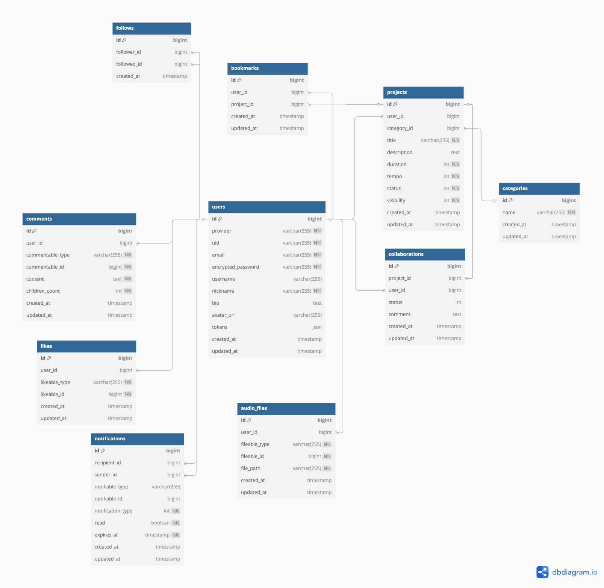

# プロジェクト名: 『JamMy』

  
  

## 📖 目次
### 🔍 基本情報
1. [サービス概要 🎵](#サービス概要)
2. [サービスURL 🔗](#サービスURL)
3. [サービス開発の背景 💡](#サービス開発の背景)

### ⚙️ 詳細情報
4. [主な機能 🚀](#主な機能)
5. [その他の機能 🔧](#その他の機能)
6. [アプリのポイント ⭐](#アプリのポイント)
7. [技術構成について 🛠️](#技術構成について)
8. [技術選定理由 🤔](#技術選定理由)
9. [今後の課題 📌](#今後の課題)
10. [ER図 🗺️](#ER図)
11. [画面遷移図 📊](#画面遷移図)

  

## 🎵サービス概要

### 繋がる、創る、響き合う。

JamMyは、録音した音を重ねて仲間とコラボできる音声合成サービスです。楽器がなくても、歌が苦手でもOK。初心者でも直感的な操作で、簡単にユニークなサウンドを創れる。遊び心とひらめきで、新しい音楽体験を提供します。

  

## 🔗サービスURL
[https://www.jam-my.com/](https://www.jam-my.com/)

🛠️ **ゲストユーザー1**  
 **メールアドレス**：`jammy.guest1@gmail.com`  
 **パスワード**：`password`

🛠️ **ゲストユーザー2**  
 **メールアドレス**：`jammy.guest2@gmail.com`  
 **パスワード**：`password`

 

🌾ゲストユーザーアカウントはご自由にご利用ください

  

## 💡サービス開発の背景

私は約24年間、習い事でピアノを習ったり、楽器を持ち寄って仲間とバンド活動をしたり、即興セッションをしたり、講師としてレッスンをしたりと、長く音楽を趣味としてきました。

音楽は一人で楽しむだけでなく、「共に何かを創る」喜びがあります。しかし、楽器が弾けない、歌が歌えない、人前で演奏するレベルではない、という理由で、自分の音楽を他人に表現したり共有したりする事にハードルを高く感じる人も多いのではないでしょうか。

私が音楽を長く続けられている理由は、「鍛錬・練習」だけでなく「遊び」を大事にしているからです。楽しく遊ぶために鍛錬があると考えており、音楽を始めたばかりの人が「鍛錬・練習」から入ることで、純粋に音楽を楽しむ原体験が不足してしまうことが多いと感じていました。その結果、途中でやめてしまう人も多く、それが非常にもったいないと考えています。

音楽アプリは、遊ぶだけでもある程度の知識やスキルが求められるものが多いです。そこで、初心者や素人でも遊び感覚で楽しめ、共に創る喜びを得られるサービスを作りたいと思い、このWebサービスを開発しました。

  

## 🚀主な機能

  

<table align="center">
  <tr>
    <th style="text-align:center; font-size:18px;">音声投稿機能</th>
    <th style="text-align:center; font-size:18px;">応募機能</th>
    <th style="text-align:center; font-size:18px;">音声合成機能</th>
  </tr>
  <tr>
    <td width="33%"></td>
    <td width="33%"></td>
    <td width="33%"></td>
  </tr>
  <tr>
    <td valign="top">音声を録音し、編集した上で投稿できます。

      
 <strong>詳細はこちら</strong>
録音に際しては、あらかじめ秒数とBPM(スピード)を決めて、録音前のカウントインやメトロノームの有無、どのマイクを使用するかを指定できます。マイク入力を中央のビジュアライザーで確認する事ができます。録音後は録音した音声の確認や、音量調整ができます。</td>

    <td valign="top">投稿された音声に合わせて録音し、コラボ応募ができます。

      
 <strong>詳細はこちら</strong>
録音→応募までは投稿時と同じ流れですが、録音時に投稿音声を再生したり、録音後に同時再生し確認する事ができます。</td>

    <td valign="top">応募された音声を編集・合成できます。

      
 <strong>詳細はこちら</strong>
ここでは応募された音声を選択し、スロットに展開、音量調整を行います。同時に2つまで編集ができ、編集を行ったものは合成リストに追加できます。合成リストでは、合成を行う最終確認を行い、合成ボタンを押し、その後保存を押すと合成内容が保存されます。</td>

  </tr>
</table>

  
  

## 🔧その他の機能

  

<table align="center">
  <tr>
    <th style="text-align:center; font-size:18px;">ユーザー登録機能</th>
    <th style="text-align:center; font-size:18px;">フィードバック機能</th>
    <th style="text-align:center; font-size:18px;">マイページ機能</th>
  </tr>
  <tr>
    <td width="33%"></td>
    <td width="33%"></td>
    <td width="33%"></td>
  </tr>
  <tr>
    <td valign="top">ユーザーログイン、新規登録および、Googleアカウントでのログインができます。

      
 <strong>詳細はこちら</strong>
新規登録、Google認証後は自動ログインがされ、ログイン時に「ログイン状態を保持する」にチェックを入れるとログイン状態を1日→2週間に延ばす事ができます。フォームでは入力バリデーションがリアルタイムで行われます。また、通常の新規登録ではメール認証が必要となっており、認証後に自動でログインされ、アプリをそのまま利用できます。パスワードリセットについてもメールベースで行います。</td>

    <td valign="top">投稿に対して「コメント」「いいね」「ブックマーク」「共有（リンク、およびXへの投稿）」ができます。

      
 <strong>詳細はこちら</strong>
コメントについては投稿詳細ページで行い、削除もこちらで行います。</td>

    <td valign="top">マイページで投稿の確認やプロフィール編集が行えます。

      
 <strong>詳細はこちら</strong>
ここでは自分の投稿や応募状況、ブックマーク等がタブ毎に分かれており、すぐに確認ができます。また、画面上部でプロフィールの編集を行い、アバターやニックネーム、自己紹介の変更ができます。今いるタブを再度押すと、そのタブ部分のみリロードができます。</td>

  </tr>
</table>

  

<table align="center">
  <tr>
    <th style="text-align:center; font-size:18px;">通知機能</th>
    <th style="text-align:center; font-size:18px;">投稿一覧機能</th>
  </tr>
  <tr>
    <td width="50%"></td>
    <td width="50%"></td>
  </tr>
  <tr>
    <td valign="top">通知を確認できます。

      
 <strong>詳細はこちら</strong>
ログイン後やアプリ起動時に通知がある場合は、ボトムナビの通知ボタン横に赤点が表示されます。通知ページに移動すると他のユーザーからのフィードバックや、応募、コラボ等の通知が確認できます。該当の通知をクリックすると、関連する投稿の詳細ページへ遷移します。なお、スマホの場合このページにおいて画面上部で下スクロールする事で最新の通知を読み込む事ができます。</td>

    <td valign="top">投稿一覧ページでは、自分や他のユーザーの投稿を確認する事ができます。

      
 <strong>詳細はこちら</strong>
通知ページと同様に画面上部で下スクロールする事で最新の投稿を読み込む事ができます。この一覧ページは無限スクロールで実装されており、下へスクロールすると時系列で過去の投稿を次々と読み込み、表示します。また、自分の投稿に限り、この投稿一覧および投稿詳細ページにて投稿右上のメニューより投稿の編集、削除が行えます。</td>

  </tr>
</table>

    

## ⭐アプリのポイント
### シンプルかつ直感的なUI 🖥️
・当アプリは音楽の初心者から中級者までを想定しており、事前知識がなくても直感的に操作が行えるようUIにこだわっています。また、録音をいつ、どこでもできるようにスマホでの利用を想定し、ベースはスマホのネイティブアプリライクに設計されています。

### シンプルながらも高音質な音声処理 🎛️
・音声処理については投稿ページからの再生のみ,「HTMLAudioElement API」を利用し、ほか、録音、編集、再生、合成等は全てWebAudioAPIを活用して高品質かつ、柔軟な音声処理に対応しています。またシンプルながらも使いやすく、高音質になるように以下の工夫を行いました。
 

#### 1. 音質へのこだわり 🔊
「録音の段階から高音質な音声形式を利用し、マルチスレッドで並列処理を行う事でパフォーマンスも向上！」
  

    
 <strong>詳細はこちら</strong>

  RecordingAPIは実装は簡単ですが、音声形式が圧縮コーデックしか利用できず、音声のデコードとエンコードの繰り返しにより音質が劣化します。これは特定のエフェクト（リバーブやピッチ変更等）においては、エフェクトそのものが機能しなくなる原因にもなります。そこで、非圧縮コーデックで音声を録音するため、WebAudioAPIのAudioWorkletNode（ワーカースレッド）を利用し、高音質な録音を実現しています。メインとワーカースレッドとのやりとりはメッセージの送受信により行い、これらを録音ボタンの押下等の特定のアクションにトリガーされる形で実装しています。

   

#### 2. 使いやすさへのこだわり 🔄
「応募する時に、投稿音声を聞きながら録音ができるので、録音しやすい！」
  

    
 <strong>詳細はこちら</strong>

  投稿音声と、応募音声の「同時再生」あるいは、再生しながらの録音については、WebAudioAPIを大きくカスタムする必要がありました。具体的には、録音、投稿音声、応募音声等、各処理主体がReactのContextを利用し、署名とフラグの設置を通じて相互に連携を行う形をとっています。これにより、「音に合わせて録音する」上で、音ズレの発生を最小限にしています。

   

#### 3. 品質とコストの両立 💰
「音声ファイルを軽くして、音質も維持！」
  

    
 <strong>詳細はこちら</strong>

  音声コーデックについて。応募音声、コラボ中の音声、コラボ終了後の音声については音声ファイルにてファイルサーバーに保存しています。問題は、WebAudioAPIで編集する際は必ずより低レイヤーのBuffer形式に都度デコードする必要がある事です。応募→コラボ受け入れまでの間にファイル化、音声処理が介在する為、デコードとエンコードを繰り返す事になり、音質劣化の要因となります。一方で高音質大容量の非圧縮コーデックのままストレージへ保存する事はコスト増に繋がります。そこで、コラボ中の音声コーデックは全て可逆圧縮のFLAC形式にエンコードし、音質の担保と容量節約を同時に実現しています。コラボ終了時は不可逆圧縮のMP3へとエンコードし、容量節約のみを行っています。

   

>#### 📚用語補足
  >- 非圧縮コーデック(PCM / WAV)・・・圧縮されていない音声形式で、DAW等のより高度かつ高音質の音声処理に用いられる。（例えば一般的な設定、44.1kHz、16bit、ステレオならおおよそ60秒のファイルでサイズは約10MB）
  >- 不可逆圧縮コーデック(MP3 / AAC)・・・音声を圧縮、かつ圧縮前に戻せない形式で、一般的な音楽再生に用いられます。(60秒のファイルでサイズは約1MB)
 > - 可逆圧縮コーデック(FLAC)・・・音声を圧縮するが、圧縮前にデコードして戻せる形式。（60秒のファイルでサイズは約5MB）

  

### パフォーマンス・コスト管理の徹底 ⚡
・パフォーマンス、コスト意識から不必要なリクエストを最小限にし、APIの負荷を低下させる方針で以下のように実装しています。

 

#### 1. キャッシュの最適化 🏎️
「キャッシュを活用して、表示速度を高速に！」
  

    
 <strong>詳細はこちら</strong>

  フロントキャッシュとしてSWRを導入しています。SWRはほとんどリアルタイム通信に近いレベルでデータ再検証ができるオプションが多く用意されていますが、アプリ運営の初期の段階ではこれは過剰であり、パフォーマンス低下も招きます。そこで、データの初回フェッチを含めてほぼ全ての再検証を手動化し、特定のアクションに基づいてのみ、再検証が行われるような設計にしました。これにより、再検証については基本的にはユーザーからの明示的なアクションを元に行い、データの変更に関連する処理がなされた際に再検証を手動で行うという形をとる事で、データの整合性を担保しています。また、手動化により、例えばタブを2回押下する事により、そのタブの分だけ再検証するという効率的な挙動を実現しています。また、例えばいいね、ブックマーク、投稿削除等については、レスポンスを待たずにキャッシュを変更する楽観的更新にてキャッシュを更新しており、応答速度の短縮に努めています。

   

#### 2. 通信コストの削減 📡
「通信コストを削減して、パフォーマンス向上！通信延滞の予防も！」
  

    
 <strong>詳細はこちら</strong>

  画像・音声ファイル等の大容量のリソースについては、AWSのS3にて管理しており、バックエンドであるRailsAPIがその保存処理を担っています。フロントからのGETリクエストに対し、RailsはS3からデータを取得する責務は負いません。フロントにはS3へのキーのみを返し、フロントは環境変数とキーを組み合わせてアクセスパスを取得し、S3から直接データを取得します。これにより、頻繁にされるGETリクエストによる通信コストを低減しています。また、この際クライアントサイドからS3にアクセスさせるとアクセスパスが漏洩する為、Next.jsのAPI Routesをプロキシとして経由させる事で秘匿化を行っています。

    

## 🛠️技術構成について

| カテゴリー | 使用技術 |
|-----------|--------------|
| **フロントエンド** | Next.js 15 / React 18 / TypeScript |
| **バックエンド** | Ruby on Rails 7 (APIモード) / Ruby 3.3.5 |
| **データベース** | PostgreSQL 15.5 |
| **認証** | Devise_token_auth / Google OAuth API |
| **音声処理** | WebAudioAPI / ffmpeg.js |
| **環境構築** | Docker |
| **インフラ** | Vercel (Next.js) / Render (Rails) / Amazon S3 / Brevo(メールサーバー)|
| **その他** | SWR / MUI / jsonapi-serializer / omniauth / Rspec / yup /react-hook-form |

  

## 🤔技術選定理由
### 『フロントエンド』
- 音楽アプリ、およびCGMサービスはネイティブアプリで開発されているものが多く、Webアプリケーションでありながらも、高速で快適な操作を実現させる為に、SPAでの設計、リッチなUIを意識しました。今回、WebAudioAPIの実装を行う上で、コンポーネントを再利用できる点、音声機能には再レンダリングが多く発生するため、仮想DOMで効率的に処理できる点でReactが適していると判断しました。また、Next.jsでは、ルーティングの簡易さ、強力なサーバーサイド処理がデフォルトで備わっており、コミュニティも広い事からVue.jsではなくこちらを選定しました。
- 実装途中まではJavaScriptで開発していましたが、型安全に運用し、堅牢なアプリを提供したく、TypeScriptでの実装に切り替えました。

### 『バックエンド』
- Railsの「設定より規約」という原則、ライブラリの多さもあり、開発効率が向上すると考えました。実務上ではバックエンドをAPI化しフロントエンドと異なるフレームワークで開発する事もある為、実務も想定しつつ、スケール可能な形の実装経験を積みたかった事、また、プログラミングスクールのカリキュラムで既に学習しており、バックエンドをAPI化しデータ管理に責務を集中させるのであれば他のフレームワークを学び直すより、既に学んだRailsを利用する方が実装における時間的なメリットが高いと考えました。

### 『データベース』
- 投稿データを中心とし、通常のString、Integer、Array、Hashほか音声データも扱う為、多様なデータを扱いやすく、またインデックス検索など、より高速であり、ホスティングサービスであるRender.comにも標準装備され一括管理できるPostgresQLを選択しました。

### 『認証』
- 認証は常にセキュアであるべきで、自前の実装は大きなリスクだと考えライブラリを利用する事を検討しました。その中でも、認証はRailsに任せ、ステートレスな運用が可能であり、かつメール認証やパスワードリセットなどの機能がすぐに実装できるという点でdevise_token_authを選択しました。
- ユーザービリティの為、認証の管理責任を持つリスクを抑える為には、OAuthの導入は必須だと考えました。その中でも多くの人が利用している（SNSベースではない）Googleを選定しました。

### 『音声処理』
- 今回、「高音質な録音（非圧縮コーデック）」「リアルタイムの音声編集」「ブラウザ互換性の高さ」が音声処理に必要な項目であり、それら全てを満たすものはWebAudioAPIのみであり、最適であると判断しこちらを選定しました。
- エンコードライブラリについては、「多様なコーデックに対応している事（FLACとMP3）」「ブラウザ対応」「処理が高速である事（WASMで動いている事）」「無料」が基準でしたが、これら全てに対応しているFFmpeg.jsが適していると考えました。

### 『環境構築』
- Dockerはローカル環境と本番環境を統一的に管理できること、Render.comにおいてはコンテナをそのまま利用できる為、デプロイが効率的であること、またバージョン管理が簡単であることが導入した大きな理由です。実務上もDockerは必須のスキルだと考えており、早い段階から慣れておきたいと思い選定しました。

### 『インフラ』
- Next.jsの開発元のホスティングサービスであり、デプロイが非常に簡単であり、効率的だと考えVercelを利用しています。
- 月額コストが低い、PostgresQLの無料枠が使える、Docker環境ならデプロイがシンプル、ファイルサーバー以外は一元管理できる、ことによりRender.comを選定しました。特に個人開発であるため、運用のしやすさを重視しました。
- S3については、従量課金でコストが抑えられる事、Railsと連携しやすい事、無料枠が利用できる事により選定しました。こちらはGCPでも実現可能ですが、AWSを既に学習しており、学習コストを考慮してこちらを選定しました。

### その他
- キャッシュについて。キャッシュ導入時はクライアントサイドに重きを置いた設計をしており、クライアントキャッシュの利用を検討しました。その中でもSWRはSWRInfinityにより、無限スクロールの実装が簡易である事、シンプルなキャッシュ管理であれば、学習コストが低く実装速度が速いと考えた為、選定しました。
- MUIについて。まず、今回音声処理、キャッシュについては難しい上に実装経験がありませんでした。ユーザーが快適に操作する事が最優先であった為、プロジェクト全体の進捗を考えると、画面設計やデザインの実装時間は多く取れない前提でした。リッチなUIを、一から実装するのではなくある程度完成されているコンポーネントベースのライブラリを使い、それを適宜カスタムする事で、設計を高速化し、デザインに統一感を持たせるという意味合いもあり、MUIを選定しました。

  

## 📌今後の課題
#### 1. エンコードのパフォーマンス向上
「『FFmpeg』 → 『wasm-audio-encoders』への移行」
  

    
 <strong>詳細はこちら</strong>

エンコードライブラリ『FFmpeg』は最も汎用性が高いですが、音楽データのエンコードのみであれば『wasm-audio-encoders』の方が軽量の為、パフォーマンス向上のために今後、置き換えを行う事を検討しています。

#### 2. サーバーサイド処理（SSR/SSG）の最適化
「クライアントサイドの処理 → サーバーサイドの処理への移行」

    
 <strong>詳細はこちら</strong>

 Next.jsはAppRouterのサーバーアクション等、サーバーサイド処理を行う事で高速化、セキュアになる点にその強みがありますが、設計当初からクライアントサイドのロジックがメインになってしまっていました。今後は、ブラウザネイティブな機能以外の部分（例えばフォーム送信など）については、サーバーアクションに順次置き換えるリファクタリングを検討しています。

#### 3. キャッシュのさらなる最適化と保守性向上
「『SWR』 → 『React Query』へ移行し保守性向上」

    
 <strong>詳細はこちら</strong>

 キャッシュについて、SWRは単一のリソースの場合と、SWRInfinityのようなページ毎にキャッシュするものを同居させている状況であり、あるリソースの変更を行う際にアプリ全体のキャッシュの整合性を取る事が、仕様上難しいです。現在は、単一のリソースの変更を行う際に、重複するリソースを他のすべてのキャッシュから走査し変更を加えるという事をバッチ処理によって行うという力技で対応していますが、保守性が低い為、今後、リソース（エンティティ）単位でキャッシュ管理ができるReact Queryへの移行を検討します。

#### 4. SSEを利用した半リアルタイムの通知機能
「通知機能を拡張。アプリ利用中も通知が来たことがわかるように」

    
 <strong>詳細はこちら</strong>

通知機能について、現在、アプリ起動時およびログイン後にリクエストをAPIへ送り通知を取得してますが、今後SSE通信、Redisを利用し、アプリ利用中に通知が起こった際にRails側からクライアントに通知を送信し半リアルタイムで通知を行う機能を実装予定です。また、大量の通知が来た際に複数の通知をまとめて表示する機能も実装予定です。

#### 5. 追加実装予定の機能
「コメント返信、フォロー、追加エフェクトなどを追加実装予定」

    
 <strong>詳細はこちら</strong>

コメントに対する返信機能、コメントや返信へのいいね機能、フォロー機能、ハッシュタグ機能、カテゴリー機能等を追加実装予定です。音声編集において、現在は音量調整のみですが、今後WebAudioAPIを引き続き活用してエフェクトを追加したり、タイミングを調整する機能の追加など、拡張予定です。OAuthについてはAppleを追加導入予定です。

  
  

## 🗺️ER図

  
  

## 📊画面遷移図（企画当初のもの）
[画面遷移図](https://www.figma.com/design/kQs5aYl2Gw0xblJSPErzKL/%E7%94%BB%E9%9D%A2%E9%81%B7%E7%A7%BB%E5%9B%B3-(JamMy)?node-id=4662-14&t=y76lxv7b8GEd4rdt-1)

---
